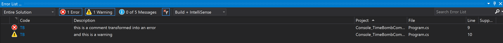

# RSCG_TimeBombComment

Time Bomb comment for technical debt

Just add :

//TB: 2021-09-13 this is a comment transformed into an error

and you will see the error!

The general form is

//TB: yyyy-MM-dd whatever here

[](https://github.com/ignatandrei/RSCG_TimeBombComment/actions/workflows/dotnet.yml)


[](https://www.nuget.org/packages/RSCG_TimeBombComment/)

## Examples

    
```cs
//TB: 2020-09-13 this is a comment transformed into an error
```

will produce an error

[](docs/error.png)

## Usage for technical debt 
